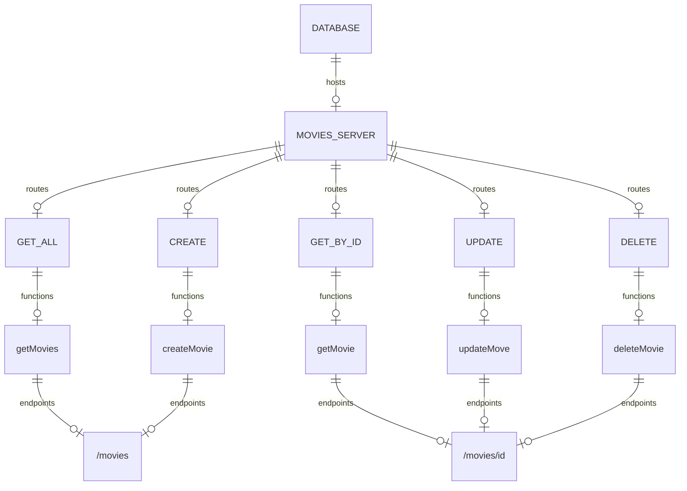

# Go CRUD API

SIMPLE CRUD API

### Libraries Used
* Gorilla Mux

```mermaid
erDiagram
    DATABASE ||--o| MOVIES_SERVER: hosts
    MOVIES_SERVER ||--o| GET_ALL: routes
    MOVIES_SERVER ||--o| GET_BY_ID: routes
    MOVIES_SERVER ||--o| CREATE: routes
    MOVIES_SERVER ||--o| UPDATE: routes
    MOVIES_SERVER ||--o| DELETE: routes
    GET_ALL ||--o| getMovies: functions
    GET_BY_ID ||--o| getMovie: functions
    CREATE ||--o| createMovie: functions
    UPDATE ||--o| updateMove: functions
    DELETE ||--o| deleteMovie: functions
    getMovies ||--o| "/movies": endpoints 
    getMovie ||--o| "/movies/id": endpoints
    createMovie ||--o| "/movies": endpoints
    updateMove ||--o| "/movies/id": endpoints
    deleteMovie ||--o| "/movies/id": endpoints
```